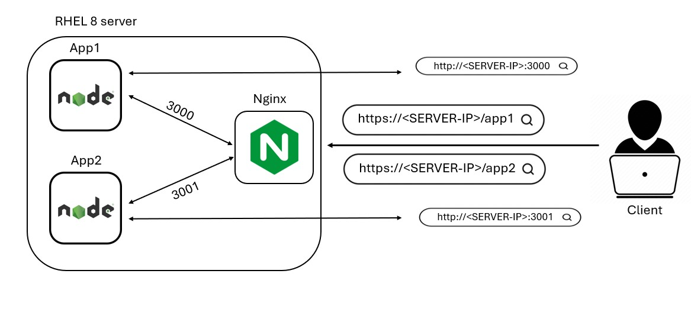

# Home Exercise – Secure WebSocket

## Description
This solution demonstrates a setup with three containers:

1. **App1**: A simple Node.js application displaying "Hello World". It is exposed on port 3000.
2. **App2**: A WebSocket application that echoes messages sent to it. It is exposed on port 3001.
3. **Nginx**: A custom Nginx container that routes traffic to App1 and App2, operating with HTTPS protocol using a self-signed certificate.

## System Diagram



## Prerequisites
- RHEL 8 / CentOS Stream 8 server
- Docker and Docker Compose installed on the server

## Installation
1. Clone the repository:
   ```sh
   git clone https://github.com/galshirizli/websocketApp.git
   ```
2. Run Docker Compose:
   ```sh
   docker-compose -f ./websocketApp/docker-compose.yaml up -d
   ```
## Access
- For App1, browse to: 'https://RHEL8-IP/app1' or 'http://RHEL8-IP:3000'
- For App2, browse to: 'https://RHEL8-IP/app2' or 'http://RHEL8-IP:3001'


## Delivery
Ensure you have the following:

- A Docker Hub account
- A Jenkins server set up
 
Steps to Build and Push Docker Images:

1. Set up Docker Hub credentials and repository names in the environment section of your Jenkinsfile
2. Set the branch name in the environment variable GIT_BRANCH.
3. Run the Jenkinsfile - Trigger the Jenkins pipeline to build and push the images.
